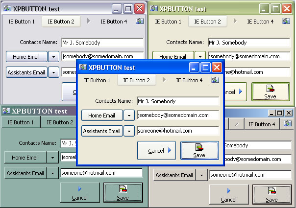



## XP Themed Button

### Description

A button that changes its display based upon the theme capabilities of the computer it is run on.

See screenshot to see what I mean.

If themes are detected buttons can:

Include Icons.

Be shown in Toolbar or Button style.

Offset the Caption and Picture so they can be drawn exactly where you want.

Draws icon disabled when button is disabled.

If no themes are detected you get a normal graphical button.

The button:

Changes display with theme change.

Contains No Timer.

Is in a single usercontrol.

You would use this button to provide backward comptability in your display whilst presenting modern buttons with icon support.

Suggestions, Votes and Feedback appreciated.

Update: Fixed bug on midi forms and added a deleteobject for the region.
 
### More Info
 

             |
---                |---
**Submitted On**   |2005-06-05 12:30:10
**By**             |[GDuncan](https://github.com/Planet-Source-Code/PSCIndex/blob/master/ByAuthor/gduncan.md)
**Level**          |Intermediate
**User Rating**    |4.7 (28 globes from 6 users)
**Compatibility**  |VB 6\.0
**Category**       |[Custom Controls/ Forms/  Menus](https://github.com/Planet-Source-Code/PSCIndex/blob/master/ByCategory/custom-controls-forms-menus__1-4.md)
**World**          |[Visual Basic](https://github.com/Planet-Source-Code/PSCIndex/blob/master/ByWorld/visual-basic.md)
**Archive File**   |[XP\_Themed\_189767662005\.zip](https://github.com/Planet-Source-Code/gduncan-xp-themed-button__1-60922/archive/master.zip)

